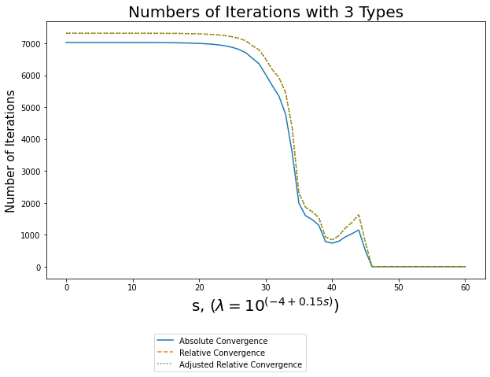
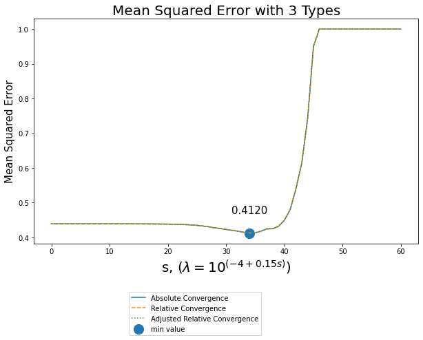
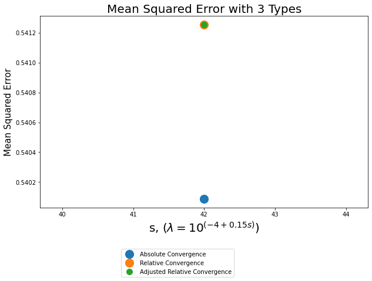
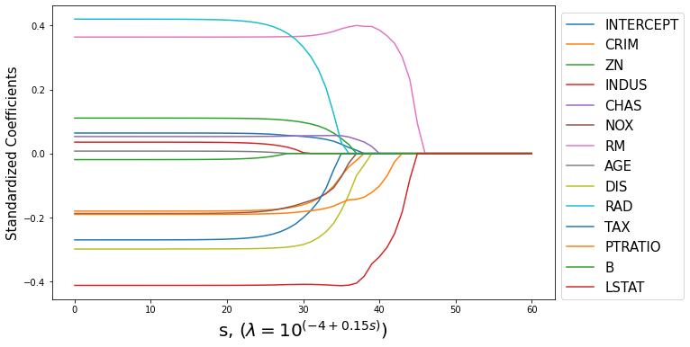
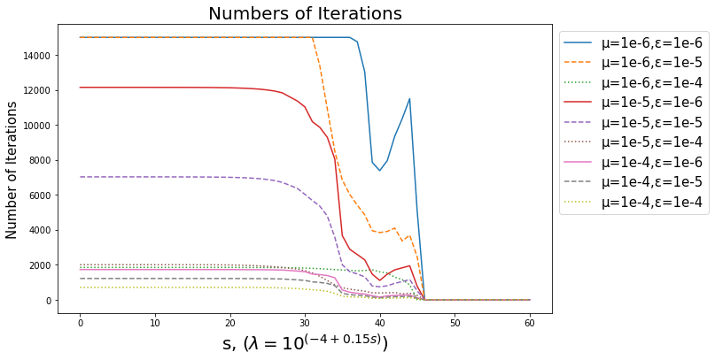
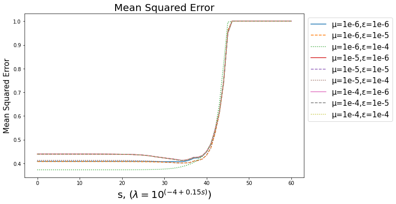

## <center>基于 Proximal 算法的 Lasso 问题求解</center>

<center>2017111910 张伯阳</center>

[TOC]

### 一、准备工作

#### 1、加载包和数据

```python
# Zhangboyang 2017111910

# 加载包
import numpy as np
import matplotlib.pyplot as plt
from sklearn.datasets import load_boston
from sklearn.model_selection import KFold

# 导入数据
x_data, y_data = load_boston().data, load_boston().target
```

#### 2、数据标准化

Lasso回归是有偏估计，会对权重进行惩罚，在量纲不同的情况，正则化会带来更大的偏差。为了令每个变量有相同的范围和方差，我们对数据进行标准化，并储存每个变量的均值和标准差，以便最后可以还原成以原始数据为变量的Lasso回归方程。

```python
# 标准化
x_mean, x_std, y_mean, y_std = np.mean(x_data, axis=0), np.std(x_data, axis=0), np.mean(y_data, axis=0), np.std(y_data, axis=0)
x_standardization = np.hstack((np.ones((np.shape(x_data)[0],1)),(x_data-x_mean)/x_std))
y_standardization = (y_data-y_mean)/y_std
```

#### 3、设置参数

在进行计算之前，我们需要先设定参数。

我们将μ设置为(0.0001,0.00001,0.000001)，ε设置为(0.0001,0.00001,0.000001)，并将二者进行组合，分别观察不同情况下对应的结果。

为了观测到更广泛的惩罚系数范围下的Lasso回归表现，我将λ的计算公式改为了：
$$
10^{(-4+0.15s)}, s=0,1,…,60
$$
result_1和result_2两个矩阵用来记录结果。

### 二、建立模型

该模型的逻辑如下：

使用K折交叉法（这里为5）分别计算不同划分情况下的均方误差、方差、偏差的平方。用全部的数据训练一组最终的参数，并记录迭代次数。

迭代过程使用Proximal 算法，详见作业PPT，此处不赘述。

求偏导的时候设置
$$
Δx_i=10^{-4}
$$
定义迭代次数上限15000，以免出现无限迭代的情况。（当然了，后期发现参数为一定的组合时，迭代次数极大，不过为了减少运算量，我并没有进一步提高迭代次数的上限）

```python
# lasso函数
def zby_2017111910_hw2_lasso(y_in,x_in,kfold_in,mu_in,epsilon_in,convergence_in,lambda_in):
    # 定义返回参数
    mse_out = 0
    variance_out = 0
    biasq_out = 0
    iteration_out = 0
    
    # 创建变量
    dimension = x_in.shape[1]
    beta_eye = np.eye(dimension)*1e-4
    beta_tmp = np.zeros(dimension) 
    beta_1 = np.ones(dimension)
    beta_2 = np.zeros(dimension)
    
    # k折交叉法循环
    kf = KFold(n_splits=kfold_in)
    for train_index, test_index in kf.split(x_in):
        x_test = x_in[test_index]
        x_train = x_in[train_index]
        y_test = y_in[test_index]
        y_train = y_in[train_index]
        beta_1[:] = 1
        beta_2[:] = 0
        iteration_out = 0
        epsilon_cal=epsilon_in+1
        while iteration_out<= 15000 and epsilon_cal>=epsilon_in :
            beta_1 = beta_2+0
            iteration_out = iteration_out+1
            y_tmp = np.sum((y_train.reshape((y_train.shape[0],1))-np.dot(x_train, (beta_1+beta_eye).T) )**2,axis=0)
            beta_tmp = beta_1-mu_in*1e4*(y_tmp-sum((y_train-np.dot(x_train ,beta_1))**2))
            tmp_1 = (1-lambda_in*mu_in/abs(beta_tmp))
            beta_2 = beta_tmp*(tmp_1>0)*tmp_1
            epsilon_cal=np.linalg.norm(beta_2-beta_1) if convergence_in==0 else(
                np.linalg.norm(beta_2-beta_1)/(np.linalg.norm(beta_1)+1e-15) if convergence_in==1 else
                    np.linalg.norm(beta_2-beta_1)/(np.linalg.norm(beta_1)+epsilon_in)) 
            
        mse_out = mse_out + sum((y_test-np.dot(x_test,beta_1))**2)/y_in.shape[0]
        variance_out = variance_out + sum((np.mean(np.dot(x_test,beta_1))-np.dot(x_test,beta_1))**2)/y_in.shape[0]
        biasq_out = biasq_out + sum((y_test-np.mean(np.dot(x_test,beta_1)))**2)/y_in.shape[0]
    
    # 用所有数据训练一个beta出来作为最终的估计值
    beta_1[:] = 1
    beta_2[:] = 0
    iteration_out = 0
    epsilon_cal=epsilon_in+1
    
    while iteration_out<= 15000 and epsilon_cal>=epsilon_in :
        beta_1 = beta_2+0
        iteration_out = iteration_out+1 
        y_tmp = np.sum((y_train.reshape((y_train.shape[0],1))-np.dot(x_train, (beta_1+beta_eye).T) )**2,axis=0)
        beta_tmp = beta_1-mu_in*1e4*(y_tmp-sum((y_train-np.dot(x_train ,beta_1))**2))
        tmp_1 = (1-lambda_in*mu_in/abs(beta_tmp))
        beta_2 = beta_tmp*(tmp_1>0)*tmp_1
        epsilon_cal=np.linalg.norm(beta_2-beta_1) if convergence_in==0 else(
            np.linalg.norm(beta_2-beta_1)/(np.linalg.norm(beta_1)+1e-15) if convergence_in==1 else
                np.linalg.norm(beta_2-beta_1)/(np.linalg.norm(beta_1)+epsilon_in)) 
        
    return np.hstack((mu_in,epsilon_in,convergence_in,iteration_out,mse_out,variance_out,biasq_out,beta_2))

```

### 三、讨论不同惩罚系数和收敛方式下的lasso回归

#### 1、三种不同收敛方式的差异

每一个参数都有几种取值，如果组合在一起将有很多可能，限于算力，我们分成两大块进行讨论。这一部分设置μ和ε均为0.00001，讨论不同惩罚系数和收敛方式下的lasso回归。



见上图，随着惩罚系数的增加，迭代次数先缓慢下降，之后快速减少，最后在s≥46时保持为1.绝对收敛的迭代次数要略微少于相对收敛和调整的相对收敛，这是因为系数估计向量的范式要小于1，也就是说相对收敛的条件更严格，因此需要更多的迭代次数；ε的值相较于向量的第二范式几乎可以忽略不计，也就是说在此例中，相关收敛和调整的相关收敛几乎没有区别。



三种收敛方式的MSE几乎没有差别。当s<34时，MSE缓慢下降；s=34时，λ=12.5893，MSE取得最小值0.4120；之后便增大，增加速度较快；当s=46时，λ=794.3282，MSE达到1，并不再增加。

相对收敛和调整后的相对收敛完全一致，并且我找出了当s=42时，相对收敛和绝对收敛的相对差距最大，为0.2155%。该条件下点的位置如下：



因为三种收敛方式差异很小，为了简便我们仅考虑绝对收敛这一种收敛情况。

#### 2、求解回归方程

s=34时，λ=12.5893，MSE在迭代3572后取得最小值0.4120。我们决定在该条件下求解最终的估计值。



其次我们剔除绝对值不超过0.1的参数。系数显著地下降，而且迅速的趋于零，相当于失去了“预报能力”，因此可以去掉这个自变量。

对保留的变量进行相关性检验，结果如下表。我们认为CRIM和NOX与其他的自变量存在较强的相关性，因此将阈值提高为0.12，重新挑选自变量。

|         | CRIM          | NOX            | RM             | DIS     | RAD    | PTRATIO | LSTAT |
| ------- | ------------- | -------------- | -------------- | ------- | ------ | ------- | ----- |
| CRIM    | 1             |                |                |         |        |         |       |
| NOX     | 0.4210        | 1              |                |         |        |         |       |
| RM      | -0.2192       | -0.3022        | 1              |         |        |         |       |
| DIS     | -0.3797       | <u>-0.7692</u> | 0.2052         | 1       |        |         |       |
| RAD     | 0.6255<u></u> | <u>0.6114</u>  | -0.2098        | -0.4946 | 1      |         |       |
| PTRATIO | 0.2899        | 0.1889         | -0.3555        | -0.2325 | 0.4647 | 1       |       |
| LSTAT   | 0.4556        | <u>0.5909</u>  | <u>-0.6138</u> | -0.4970 | 0.4887 | 0.3840  | 1     |

最后将中心标准化的数据还原得到最终的系数，其公式为:
$$
β'_0=(β_0-\sum_{i=1}^Nβ_i\frac{E(x_i)}{Std(x_i)})Std(MEDV)+E(MEDV)\\
β'_i=β_i\frac{Std(MEDV)}{Std(x_i)}
$$
各步所得结果见下表：

| 变量名    | 标准化系数  | 剔除小绝对值后系数 | 最终系数    |
| --------- | ----------- | ------------------ | ----------- |
| INTERCEPT | 0.03810441  | 0                  | 18.25660903 |
| CRIM      | -0.10180109 | -0.10180109        | 0           |
| ZN        | 0.06366595  | 0                  | 0           |
| INDUS     | 0           | 0                  | 0           |
| CHAS      | 0.05613485  | 0                  | 0           |
| NOX       | -0.10724627 | -0.10724627        | 0           |
| RM        | 0.38167518  | 0.38167518         | 4.99604425  |
| AGE       | 0           | 0                  | 0           |
| DIS       | -0.21862012 | -0.21862012        | -0.95486646 |
| RAD       | 0.12406402  | 0.12406402         | 0.1310435   |
| TAX       | -0.05137952 | 0                  | 0           |
| PTRATIO   | -0.16470453 | -0.16470453        | -0.69969647 |
| B         | 0           | 0                  | 0           |
| LSTAT     | -0.41246373 | -0.41246373        | -0.5312196  |
| 对应的r方 | 0.712871476 | 0.686389780        | 0.610400761 |

最终得到的公式为
$$
\widehat{MEDV}=18.2566+4.9960RM-0.9548DIS+0.1310RAD
-0.6997PTRATIO-0.5312LSTAT
$$

```python
# 提取系数
re_min = np.argmin(result_1[:,6])
print(result_1[re_min,range(0,9)])
print(result_1[re_min,range(9,23)])
beta_result = result_1[re_min,range(9,23)]+0
1-sum((y_standardization-np.dot(x_standardization,beta_result))**2)/sum((y_standardization)**2)

# 挑选变量
for i in range(0,beta_result.shape[0]):
    if abs(beta_result[i])<=0.1:
        beta_result[i] = 0
1-sum((y_standardization-np.dot(x_standardization,beta_result))**2)/sum((y_standardization)**2)
print(beta_result)

# 相关系数矩阵
print(np.corrcoef(x_standardization[:,[1,5,6,8,9,11,13]].T))

# 挑选变量
for i in range(0,beta_result.shape[0]):
    if abs(beta_result[i])<=0.12:
        beta_result[i] = 0
1-sum((y_standardization-np.dot(x_standardization,beta_result))**2)/sum((y_standardization)**2)
print(beta_result)

# 还原参数
beta_result_2 = result_1[re_min,range(9,23)]+0
beta_result_2[0] = (beta_result[0]-sum(beta_result[range(1,beta_result_2.shape[0])]*x_mean/x_std))*y_std+y_mean
beta_result_2[range(1,beta_result_2.shape[0])] = beta_result[range(1,beta_result_2.shape[0])]*y_std/x_std
print(beta_result_2)
1-sum((y_standardization-np.dot(x_standardization,beta_result))**2)/sum((y_standardization)**2)
```

#### 3、方程解释

$$
\widehat{MEDV}=18.2566+4.9960RM-0.9548DIS+0.1310RAD
-0.6997PTRATIO-0.5312LSTAT
$$

我们剔除了城镇人均犯罪率、占地面积超过 25,000 平方英尺的住宅用地比例、每个城镇非零售业务的比例、是否是河道、一氧化氮浓度（每千万份）、1940 年以前建造的自住单位比例、每 10,000 美元的全额物业税率、城镇黑人比例函数这几个自变量。从Lasso回归的观点来看，上述自变量对于因变量不起重要作用。

考虑到对学得参数的解释都大同小异，下面我们以DIS为例：在其他自变量不变的情况下，加权距离波士顿的五个就业中心每增加1单位，会使房屋价格平均降低0.9549千美元。

对该回归方程分析后，我们认为变量的选取及其系数大小的排序都很符合实际情况。从原先的13个自变量到现在的5个，并且仍有  0.6104的r方，可以视作比较成功的降维。

### 四、讨论不同μ和ε下的lasso回归

#### 1、迭代次数

设置收敛方式为绝对收敛，将μ设置为(0.0001,0.00001,0.000001)，ε设置为(0.0001,0.00001,0.000001)，并将二者进行组合，分别观察不同情况下对应的结果。



（为了减少计算量并且避免无限迭代的现象发生，我们人为设置了15000次的迭代上限，这并不代表μ=1e-6且s<32时ε=1e-5和ε=1e-6条件下的实际迭代次数相同）

从上图可以看出，固定μ不变，随着ε的增大，结束收敛的条件变得宽松，因此迭代次数减少。

固定ε不变，随着μ的增大，在Proximal 算法中每一步的步长增大，迭代次数减少。但当ε=1e-4时，在较小的s下，μ=1e-5的实际迭代次数多于μ=1e-5。

上述的结论只能使用在合适的范围内：当ε过大，会使得精确性较差；μ过大则会出现因为步长过长而导致估计向量的范式越来越大无法收敛的现象。

随着λ的增大，迭代次数逐渐减小，当λ数量级较小的时候，这一影响很微弱。λ增大到一定次数时，迭代次数有所反弹，我个人猜测是过大的λ使得
$$
(1-\frac{λμ}{|\widetilde{β_j^t}|})_+
$$

更易取0，降低一次迭代的作用，从而增加迭代次数。

#### 2、MSE值



如图，当λ较小时，不同参数下的MSE差距较大，随着λ的增大而逐渐趋近，最后均达到1.大部分曲线都在s=34时取到最小MSE，第一条曲线为s=30，可见ε和μ对最佳惩罚参数的影响没有那么大。曲线3的最佳惩罚参数为λ=1e-4，可以认为他的最优惩罚参数要小于图上可见的范围。（虽然我让λ很小很小也没找到它最优的位置在哪，这条一直是单调递增）

以s=0为截面，曲线3mse最低，曲线1、2、6次之，不过由于曲线1、2并未完全迭代，因此无法得到准确结论。但我们可以发现不考虑迭代次数所消耗的算力时，最好是运用较小的μ得到相对低的MSE值。三种μ下ε=1e-4都会得到最小的MSE。
